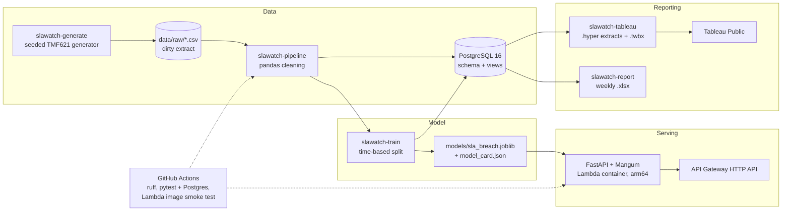

# slawatch

[](https://github.com/arda-ulas/slawatch/actions/workflows/ci.yml)
[](https://ud9fgjqcgl.execute-api.ca-central-1.amazonaws.com/docs)
[](https://public.tableau.com/app/profile/arda.ulas.ozdemir/viz/slawatch/slawatchenterpriseservice-deskSLArisksyntheticdata)

SLA-breach risk analytics for a telecom provider's enterprise service desk. A seeded generator
produces a two-year trouble-ticket book shaped after the TM Forum TMF621 Trouble Ticket API,
complete with the defects a raw extract would carry; a pandas pipeline cleans it into
PostgreSQL, where SQL views give SLA compliance, backlog ageing, resolution statistics and
outage impact by customer and service; a logistic-regression classifier scores each ticket's
breach probability from creation-time features only; a FastAPI service serves that model from
an AWS Lambda container behind an API Gateway HTTP API; and the same views feed a Tableau
Public dashboard and a weekly KPI workbook. CI runs the test suite against Postgres and
smoke-tests the Lambda image on every pull request.

> **Synthetic data.** Every customer, site, service, outage and ticket in this repository is
> generated from a seed by `src/slawatch/generate.py`. No real company, network or ticketing
> system was used. All metrics below are measured on that synthetic data, and the generator's
> assumptions set the signal the model finds (see [Model](#model)).

## The business problem

An enterprise account team looks after a few dozen business customers, each with contracted
resolution targets per severity. Two things are hard to see from a ticketing tool: which of
today's new tickets are likely to miss their SLA, at the moment they are opened, while there is
still time to escalate; and how compliance and open backlog are trending per customer and per
service, so account reviews and staffing decisions rest on numbers rather than anecdotes.
slawatch answers both: a per-ticket breach probability at creation time, and monthly, weekly
and as-of-any-instant views of compliance and backlog by customer, service type, assignment
group and outage.

## Architecture



| Component | Tech | Path |
|---|---|---|
| Synthetic generator | numpy, pandas; all parameters in one module | `src/slawatch/generate.py`, `src/slawatch/config.py` |
| Cleaning and load | pandas 3, SQLAlchemy 2, psycopg 3 (`COPY`) | `src/slawatch/cleaning.py`, `src/slawatch/pipeline.py`, `src/slawatch/db.py` |
| Warehouse | PostgreSQL 16 in Docker Compose (local) and a service container (CI) | `sql/schema.sql`, `sql/views/` |
| Feature contract | pydantic schema shared by training and the API | `src/slawatch/features.py`, `src/slawatch/model.py` |
| Training | scikit-learn 1.9.1 pipeline, matplotlib plots | `src/slawatch/train.py`, `models/`, `docs/img/` |
| Scoring API | FastAPI 0.141, Mangum 0.22 | `src/slawatch/api.py`, `src/slawatch/lambda_handler.py` |
| Deployment | Lambda container image (arm64), ECR, API Gateway HTTP API, CloudWatch, AWS Budgets | `deploy/lambda/` |
| Weekly report | openpyxl workbook with live formulas | `src/slawatch/report.py`, `reports/sample/` |
| Dashboard | tableauhyperapi extracts, generated `.twb` and packaged `.twbx` | `src/slawatch/tableau.py`, `tableau/` |
| CI | GitHub Actions, uv 0.12.10, Docker Buildx, Lambda Runtime Interface Emulator | `.github/workflows/ci.yml` |

## Data

The ticket shape follows TMF621, flattened to snake_case: `id`, `ticket_type`, `severity`,
`priority`, `status`, `channel`, `creation_date`, `expected_resolution_date`,
`resolution_date`, the related customer / site / service / assignment group, and a separate
`statusChangeHistory` file. The default run (`seed 20240701`, 2024-07-01 to 2026-07-01) writes
**40 customers, 444 sites, 885 service instances, 16 SLA targets, 8 regional outages,
200,000 tickets and 870,359 status changes**. Arrivals follow weekday, hour-of-day and month
profiles with 8 %/year growth; resolution time is log-normal around the contractual target
with additive effects for severity, tier, service, channel, after-hours, weekend, active
outage and assignment-group backlog, plus hidden per-customer and per-group latents. The
result is a **15.10 % breach rate among resolved tickets** (29,654 of 196,387).

The raw ticket extract is deliberately dirty, and the exact counts are recorded in
`synthetic_generation_metadata.json` so the cleaner can be checked against the truth:

| Injected defect | Rows (default run) | What the pipeline does |
|---|---|---|
| Local-offset timestamps (`-05:00`) | 9,986 creation, 9,823 resolution | parsed to UTC |
| Naive timestamps (no zone) | 3,980 creation, 3,974 resolution | parsed as UTC |
| Casing variants (`Web Portal`, `MAJOR`) | 6,081 | normalised to snake_case |
| Padded whitespace / tabs | 4,013 | stripped |
| Missing priority | 2,015 | imputed from severity |
| Missing description | 9,943 | kept (optional field) |
| Exact duplicate rows | 600 | dropped |
| Resolution before creation | 160 | rejected with a reason to `synthetic_tickets_rejected.csv` |

The load ends with 200,600 raw rows becoming **199,840 `fact_ticket` rows** and 870,359
history rows becoming 869,667 (692 orphans of rejected tickets dropped); every count is stored
with the load in `load_run.cleaning_report`. Details: [`docs/data.md`](docs/data.md).

## Analytics

`sql/views/` is applied by the pipeline after the load:

| File | Objects |
|---|---|
| `10_sla_compliance_monthly.sql` | `v_sla_compliance_monthly` (customer x service type x month) |
| `20_backlog_ageing.sql` | `f_backlog_ageing(as_of)`, `f_open_tickets(as_of)`, `v_backlog_ageing_monthly`, `v_backlog_ageing_current`, `v_backlog_ageing_monthly_by_service` |
| `30_resolution_stats.sql` | `v_resolution_stats` (MTTR p50/p90 with `GROUPING SETS`) |
| `40_outage_impact.sql` | `v_outage_impact`, `v_outage_vs_normal` |
| `50_customer_risk_trend.sql` | `v_customer_risk_trend`, `v_top_customers_at_risk` (3-month rolling breach rate, improving / worsening) |
| `60_ticket_risk.sql` | `v_ticket_risk`, `v_risk_band_summary` (model scores joined back to outcomes) |
| `70_weekly_kpi.sql` | `v_weekly_kpi`, `v_weekly_kpi_by_customer`, `v_weekly_kpi_by_service` |

Headline findings on the synthetic book (each one is traced back to the generator's
assumptions in [`docs/findings.md`](docs/findings.md)):

* **Outages are 4.3 % of tickets but drive the monthly curve.** Tickets opened during an
  active outage for their region and service type breach at 54.6 % against 13.3 % otherwise,
  and every month with an outage shows as a spike in `v_sla_compliance_monthly`.
* **Nights and weekends are the biggest creation-time risk factor.** Breach rate goes from
  10.3 % on weekday business hours to 38.9 % on weekend nights.
* **Backlog pressure only bites at the top.** The first four quintiles of assignment-group
  backlog sit at 11.7–14.9 % breach; the top quintile jumps to 21.8 %.
* **Bronze customers breach the most despite the loosest targets** (21.9 % versus 14.5–14.8 %
  for the other tiers), and reopened tickets breach at 79.9 %, but a reopen is only known
  after the fact, which is why it stays out of the model.

## Model

**Setup.** Training uses resolved tickets only (196,387 rows) and the split is by creation
month, not random: train 2024-07 to 2025-12 (144,872 rows), validation 2026-01 to 2026-03
(25,248), test 2026-04 to 2026-06 (26,267 rows, 3,786 breaches, prevalence 0.1441). Every
choice (feature handling, hyperparameters, the review threshold) was made on validation; the
test months were scored once. The 19 features are all available when a ticket is opened:
ticket type, severity, priority, channel, tier, industry, region, province, service type,
assignment group, customer, backlog in the group, SLA target hours, local hour and weekday,
and the boolean flags for active outage, weekend, after-hours and a requested resolution date.
`site_id` and `service_id` were dropped as high-cardinality identifiers; the outage identifier
became a boolean.

**Leakage controls.** `MODEL_FEATURES ∩ OUTCOME_FIELDS` is asserted empty at import time and
the pydantic schema rejects outcome fields such as `status` or `reopen_count`; training on
shuffled labels gives validation ROC-AUC 0.4924; adding `reopen_count` as a positive control
lifts it from 0.7092 to 0.7901, so an outcome column would be caught; adversarial validation
(train versus test rows) scores 0.7255 and drops to 0.5493 without the backlog feature, which
identifies backlog drift as the thing to monitor in production.

**Test months (synthetic data), logistic regression versus the constant baseline:**

| | Baseline (prevalence) | Logistic regression (shipped) | Gradient boosting |
|---|---|---|---|
| ROC-AUC | 0.5000 | **0.7385** | 0.7375 |
| PR-AUC | 0.1441 | **0.3653** | 0.3636 |
| Brier score | 0.1235 | **0.1090** | 0.1091 |
| Log loss | 0.4129 | **0.3631** | 0.3635 |
| ECE (10 deciles) | – | **0.0077** | 0.0090 |

The review threshold is the 90th percentile of validation scores, **p ≥ 0.2634**; on the test
months it flags 3,534 tickets (13.5 %) at precision 0.3922 and recall 0.3661, a 2.72x lift.
Cutting the top 10 % by rank instead gives precision 0.4305 and recall 0.2987 (2.99x). Risk
bands for the dashboard reuse the validation quantiles (`high` ≥ 0.2634, `medium` ≥ 0.1585).


**The caveat.** The generator writes the breach mechanism down explicitly, so a ROC-AUC of
0.74 measures two things: that the pipeline recovers the effects the generator put in, and how
large the generator's noise term is relative to them. Change `RESOLUTION_NOISE_SD` in
`config.py` and the AUC moves with it. Nothing here says what the score would be on a real
service desk. Full write-up, per-segment tables and permutation importance:
[`docs/model.md`](docs/model.md); machine-readable summary:
[`models/model_card.json`](models/model_card.json).

## API

The service loads the committed artifact and refuses to start if the model card does not
describe it. Validation is the same pydantic contract as training: unknown levels,
out-of-range numbers and any outcome field are a 422.

| Endpoint | Returns |
|---|---|
| `GET /health` | status, service and model version, `trained_at`, training window, `synthetic_data: true` |
| `POST /v1/score` | probability, risk band, `flag_for_review`, the threshold, model version |
| `POST /v1/score/batch` | up to 500 tickets, results in input order; any invalid ticket rejects the batch with its index |
| `GET /v1/model` | the model card as committed |
| `GET /docs` | OpenAPI UI |

Against the live endpoint (request body from `deploy/lambda/events/score.json`: a major
SD-WAN incident opened by email on a weekend night during a regional outage):

```bash
curl -s -X POST https://ud9fgjqcgl.execute-api.ca-central-1.amazonaws.com/v1/score \
  -H 'content-type: application/json' \
  -d "$(jq -r .body deploy/lambda/events/score.json)"
```

```json
{"probability":0.756159,"risk_band":"high","flag_for_review":true,"threshold":0.26343061326384437,"model_version":"0.1.0"}
```

The same value is the golden check in `tests/test_api.py` and in the Lambda smoke test.

## Deployment

What runs in `ca-central-1`, created by `deploy/lambda/deploy.sh` on 2026-09-16 and recorded
in [`docs/evidence/aws-deploy-2026-09-16.md`](docs/evidence/aws-deploy-2026-09-16.md):

| Resource | Configuration |
|---|---|
| ECR repository `slawatch-api` | one image per git SHA (arm64, 266,294,659 bytes compressed); lifecycle keeps the last 3 |
| Lambda function `slawatch-api` | container image, arm64, 1024 MB, 15 s timeout; IAM role with `AWSLambdaBasicExecutionRole` only |
| API Gateway HTTP API `slawatch-api` | `$default` route and stage, Lambda proxy (payload v2.0) |
| CloudWatch | log group with 14-day retention |

**Cost controls.** Stage throttling at 5 requests/s sustained, burst 10; a CloudWatch alarm on
more than 5,000 invocations in an hour; an AWS Budget of $1/month with e-mail on actual spend
above 1 % and forecast above 100 %. Reserved concurrency is **not** set: a new account has a
concurrency quota of 10 that must stay unreserved, so `PutFunctionConcurrency` is rejected and
the deploy script warns and continues. The account quota itself caps parallel executions.

**Measured latency** (client side, from a laptop in Ontario, 2026-09-16): warm `POST /v1/score`
0.147–0.171 s round trip over 5 calls, with Lambda `REPORT` durations of 2–44 ms and 284 MB
peak memory; a cold start took 2.33 s round trip and the next call 0.13 s. The first-ever
invocation after creation hit Lambda's 10 s init limit on the uncached image pull, re-ran init
inside the request (4,371 ms) and succeeded; later cold starts did not repeat it. A fresh
check while writing this README: `GET /health` cold 2.31 s, `POST /v1/score` warm 0.20 s.

Teardown, which removes the HTTP API, alarm, function, log group, role and ECR repository and
then verifies nothing is left (the budget is account-level and kept):

```bash
CONFIRM=yes deploy/lambda/teardown.sh
```

Runbook with the equivalent manual commands: [`docs/deploy.md`](docs/deploy.md).

## Dashboard and report

[](https://public.tableau.com/app/profile/arda.ulas.ozdemir/viz/slawatch/slawatchenterpriseservice-deskSLArisksyntheticdata)

`make tableau` writes CSV extracts from the views, one `.hyper` extract per data source, the
workbook XML `tableau/slawatch.twb` (five sources, calculated fields, eight sheets, a fixed
1200 x 900 dashboard) and the packaged `tableau/slawatch.twbx` (6.1 MB, committed), which was
opened and checked sheet by sheet in Tableau Public 2026.2 and published. The dashboard has a
KPI row, weekly ticket volume with outage-week tickets in red, a customer x service-type
compliance heatmap centred on 85 %, backlog ageing by age band, predicted-versus-observed
breach rate by probability decile on the test months, a site map by city, and four filters.
Spec, verification table and file inventory: [`tableau/README.md`](tableau/README.md).

`make report` writes a six-sheet workbook for one Monday–Sunday week from the same views:
*Summary* (KPI tiles versus the prior week and the trailing 4-week average, a 13-week trend
table, two native charts), *By customer*, *By service*, *Backlog ageing* (age-band matrices by
assignment group and by service type), *At-risk open tickets* (top N by the model's breach
probability) and *Notes*. Tiles, deltas, totals, ticket age and past-due flags are Excel
formulas over the copied numbers, and the tests re-evaluate those formulas against a pandas
cross-check of the same week. One sample is committed:
[`reports/sample/synthetic_weekly_kpi_2026-06-28.xlsx`](reports/sample/synthetic_weekly_kpi_2026-06-28.xlsx).

## Engineering decisions

* **Postgres in Docker Compose and a CI service container, not RDS.** The analytics layer is
  views over a 200k-row book, the API never touches the database, and a `postgres:16`
  container gives the same engine locally and in CI with nothing to pay for or tear down.
* **Logistic regression over gradient boosting.** The tuned boosted model is inside the
  bootstrap interval of the linear one (ROC-AUC 0.7375 versus 0.7385 ± 0.0043), and the
  linear model is calibrated by construction (ECE 0.0077) and 4,975 bytes.
* **Commit the artifact, pin scikit-learn, verify the card at startup.** The API and the
  Lambda image need no data or training run; `scikit-learn==1.9.1` is pinned because the
  artifact is a pickle of that version, and `check_card` compares version, thresholds,
  `trained_at`, sklearn version, feature list and byte size before serving anything.
* **Lambda container image on arm64.** The runtime imports numpy, pandas, scipy and
  scikit-learn, so a container built from `uv.lock` is the reliable packaging; arm64 builds
  natively on Apple Silicon and is billed lower per GB-s beyond the free tier. CI builds and
  smoke-tests the amd64 variant of the same Dockerfile.
* **API Gateway HTTP API rather than a Function URL.** Both hand Mangum the same v2.0 event,
  so the code is identical; the HTTP API adds per-stage throttling, which became the main
  spend control once reserved concurrency turned out to be unavailable on the account.
* **Hyper extracts for Tableau.** Tableau Public refuses workbooks whose sources are not
  extracts (error 3C242D89), so the generator writes `.hyper` files with `tableauhyperapi`
  and packages them into the `.twbx` instead of pointing at CSVs.
* **pandas 3.** The lock resolves to pandas 3.0.5. The cleaners use the `string` dtype and
  `pd.NA` explicitly and return new frames rather than mutating in place, so nothing depends
  on the object-dtype and chained-assignment behaviour of the 2.x line.

## Not built / limitations

* **Synthetic data only.** The feature ranking and the AUC are properties of the generator;
  neither transfers to a real desk without re-measuring.
* **SLA semantics simplified.** No SLA clock pause while a ticket is `pending` or `held`, one
  reopen cycle at most, no priority changes over a ticket's life, and the SLA is evaluated on
  the final resolution (which is why reopened tickets breach so often).
* **No authentication or CORS on the API.** The endpoint is public, rate-limited at the stage
  and watched by an alarm and a budget; that is the whole access control.
* **No retraining pipeline or drift monitoring.** The adversarial check shows the backlog
  feature drifting inside two years of synthetic data; the monthly reliability check the model
  doc calls for is not automated.
* **Model work left on the table:** refit on train + validation before deployment,
  per-segment thresholds (the service-type table makes the case), a group-relative backlog
  feature, text features from `name` / `description`.
* **Dashboard:** generated without dashboard actions or relationships between sources (the
  fact extract carries the dimensions); the ticket-level extract (57 MB) and the `.hyper`
  files are regenerated rather than committed.
* **Deployment:** a single region, no custom domain, no provisioned concurrency, no IaC
  beyond the two idempotent shell scripts.

## How to run it

Prerequisites: Python 3.12 via [uv](https://docs.astral.sh/uv/), Docker with Compose and
Buildx, `jq`. For deployment: AWS CLI v2 with rights to ECR, Lambda, IAM, API Gateway,
CloudWatch and Budgets.

```bash
make install                  # uv sync --all-extras --all-groups
cp .env.example .env
make data                     # synthetic raw extract -> data/raw/   (make data N_TICKETS=20000 SEED=7 for a smaller run)
make db-up                    # PostgreSQL 16 in docker compose, waits for healthy
make load                     # clean -> data/processed/, load Postgres with COPY, apply sql/views/
make train                    # time-split training -> models/, docs/img/, ticket_risk_scores.csv + ticket_risk_score table
make test                     # pytest; the DB integration tests skip if Postgres is down
make lint                     # ruff check + ruff format --check
make serve                    # uvicorn on http://127.0.0.1:8000, docs at /docs
make report                   # weekly KPI workbook -> reports/  (WEEK_ENDING=YYYY-MM-DD, a Sunday)
make tableau                  # extracts, .hyper files, slawatch.twb and slawatch.twbx -> tableau/
make lambda-build             # docker buildx -> slawatch-lambda:local (LAMBDA_PLATFORM=linux/amd64 on Intel)
make lambda-smoke             # runs the image under the Lambda Runtime Interface Emulator and checks /health, /v1/score, a 422
```

`make all` runs `data`, `db-up`, `load` and `train` in sequence; `make psql` opens a shell in
the database; `make views` re-applies the views only; `make db-down` / `make db-reset` stop the
container with or without its volume. Each CLI has `--help` (`uv run slawatch-generate`,
`slawatch-pipeline`, `slawatch-train`, `slawatch-report`, `slawatch-tableau`).

Deploy and tear down (parameters are environment variables; see the script headers):

```bash
AWS_REGION=ca-central-1 deploy/lambda/deploy.sh     # ECR, role, function, HTTP API, throttle, logs, alarm
CONFIRM=yes deploy/lambda/teardown.sh               # removes all of it and verifies
```

## Repo layout

```
src/slawatch/
  config.py          every distribution and parameter of the synthetic world
  generate.py        seeded generator: dimensions, arrival process, resolution model, dirtiness
  cleaning.py        pure pandas cleaners (categoricals, duplicates, timestamps, invariants)
  features.py        creation-time-safe features vs post-resolution outcomes
  pipeline.py        raw CSV -> clean -> derive -> Postgres (COPY) -> views
  db.py              engine from $DATABASE_URL, DDL runner, COPY loader
  model.py           feature contract (pydantic), load_model / score, model-card check
  train.py           time-split training, validation-only tuning, test evaluation, artifact + plots
  api.py             FastAPI service: /health, /v1/score, /v1/score/batch, /v1/model
  lambda_handler.py  Mangum wrapper
  report.py          weekly KPI workbook (openpyxl)
  tableau.py         Tableau Public extracts, .hyper files, .twb and .twbx
  labels.py          human-readable labels for the snake_case codes
sql/
  schema.sql         dim_customer, dim_site, dim_service, sla_target, outage_incident,
                     fact_ticket, fact_ticket_status_history, ticket_risk_score, load_run
  views/             10..70: the views and functions listed under Analytics
deploy/lambda/
  Dockerfile         public.ecr.aws/lambda/python:3.12 + runtime deps from uv.lock + the model
  smoke_local.sh     runs the image under the Lambda runtime emulator and asserts on the responses
  events/            API Gateway v2.0 events for the smoke test
  deploy.sh, teardown.sh
docs/
  data.md            distributions, TMF621 mapping, injected dirtiness, leakage rules
  findings.md        what the views show on the default run
  model.md           split, features, metrics, calibration, leakage checks, what is not claimed
  deploy.md          runbook; evidence/aws-deploy-2026-09-16.md records the executed deployment
  img/               evaluation plots from `make train` and the dashboard screenshot
models/              sla_breach.joblib (4,975 bytes), model_card.json, evaluation.json
reports/sample/      one committed weekly workbook; other reports are gitignored
tableau/             README.md, slawatch.twb, slawatch.twbx, data/ (aggregate extracts committed;
                     fact_ticket CSV and .hyper files regenerated)
tests/               generator, cleaning, DB integration, model, training, API, report, Tableau
data/raw/, data/processed/   generated, gitignored
.github/workflows/ci.yml, docker-compose.yml, .env.example, Makefile, pyproject.toml, uv.lock
```

## Testing

`uv run pytest` runs **113 tests** (28 s on a laptop with the Compose database up): generator
determinism, schema and breach band; cleaning units on tiny frames; Postgres integration
(loads a small generated dataset into a separate `slawatch_test` database and checks each view
against pandas); the model module (schema, scoring, determinism) and a quick training run on a
4,000-ticket sample; the API against the committed artifact, including the golden score and
the 422 cases; the weekly report's formulas against a pandas cross-check; and the Tableau
extracts, `.hyper` files, `.twb` structure and `.twbx` packaging. The integration tests skip
when Postgres is unreachable unless `SLAWATCH_REQUIRE_DB=1`, which CI sets.

CI (`.github/workflows/ci.yml`) runs two jobs on every push to `main` and every pull request:
`uv sync --locked`, `ruff check`, `ruff format --check` and the full suite against a
`postgres:16` service container; and a Buildx build of the Lambda image (linux/amd64) followed
by the Runtime Interface Emulator smoke test, with the image size written to the job summary.
