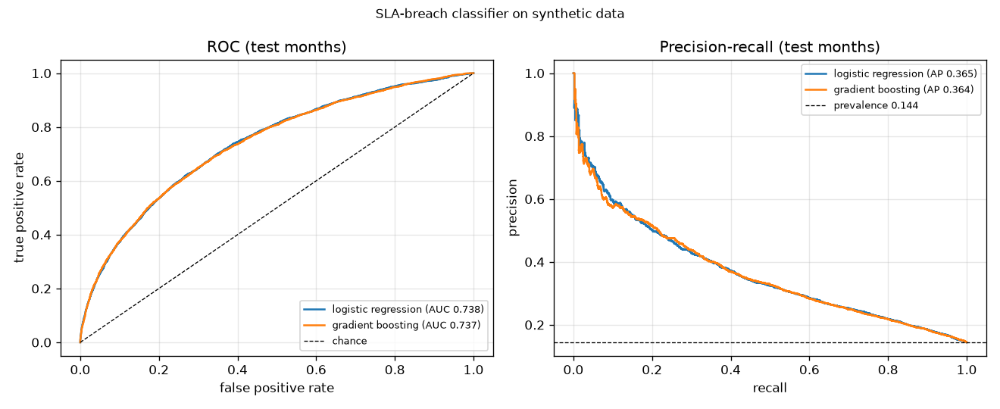
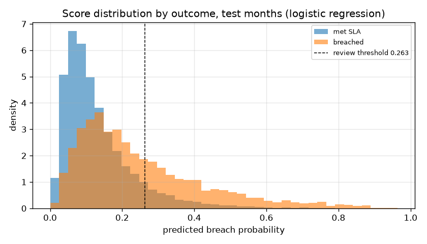
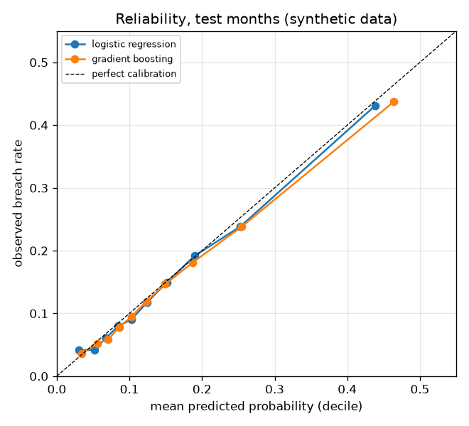
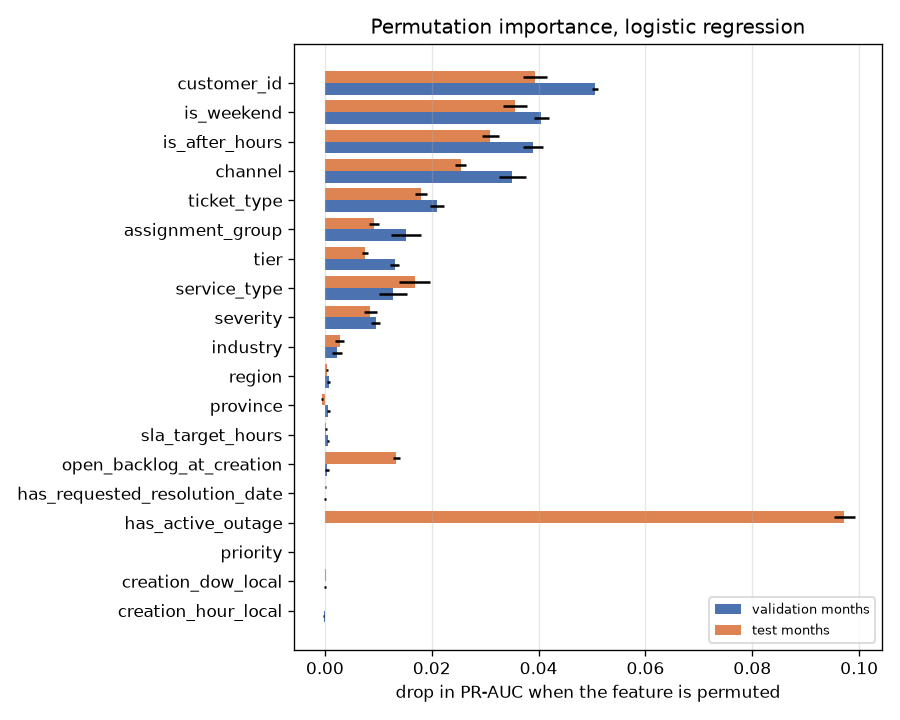

# SLA-breach classifier (synthetic data)

> **Every number on this page comes from synthetic data** generated by `slawatch-generate`
> with the default parameters (`seed 20240701`, 200,000 tickets, 2024-07-01 → 2026-07-01),
> cleaned by `slawatch-pipeline`, and trained by `slawatch-train` on 2026-09-16 with
> scikit-learn 1.9.1. The generator's own assumptions set the signal; see
> [What the model cannot claim](#what-the-model-cannot-claim) before reading anything else as a
> result. The raw output of the run is in [`models/evaluation.json`](../models/evaluation.json)
> and the deployable summary in [`models/model_card.json`](../models/model_card.json).

**Question.** At the moment an enterprise trouble ticket is opened, how likely is it to breach
its SLA? The score is served by the FastAPI endpoint (step 4) on AWS Lambda (step 5) and feeds
the Tableau dashboard (step 6) through `data/processed/ticket_risk_scores.csv` and the
`ticket_risk_score` table.

**Answer, on synthetic data.** A regularised logistic regression on 19 creation-time features
reaches **ROC-AUC 0.7385** and **PR-AUC 0.3653** on the three held-out test months, against a
breach prevalence of 0.1441 (PR-AUC of a random ranking). Reviewing the riskiest 10 % of
tickets catches 29.9 % of breaches at 43.1 % precision (3.0× lift). Probabilities are
well calibrated (Brier 0.1090 vs 0.1235 for the constant baseline; ECE 0.0077). A tuned
gradient-boosted model is statistically indistinguishable (ROC-AUC 0.7375, PR-AUC 0.3636), so
the simpler model ships: the artifact is **4,976 bytes**.

## The run

| Step | Result |
|---|---|
| `make train` | 112.4 s wall on a laptop while the test suite ran concurrently (84.6 s uncontended); the grid, experiments and probes are ~70 fits |
| Training rows | 196,387 resolved tickets with a known outcome, out of 199,840 in the processed extract (2,975 cancelled and 478 still open at the snapshot are excluded) |
| Artifact | `models/sla_breach.joblib`, 4,976 bytes (a `Pipeline` of `ColumnTransformer` + `LogisticRegression`, joblib compress level 3) |
| Outputs | `models/model_card.json`, `models/evaluation.json`, `docs/img/*.png`, `data/processed/ticket_risk_scores.csv` (199,840 rows, 33.6 MB), 199,840 rows in `ticket_risk_score` |
| Tests | `uv run pytest`: 68 passed (16 new: model module + training smoke test, ~11 s for the quick training path on a 4,000-ticket sample) |

## Data and split

Training uses **resolved tickets only** (`is_resolved` and `sla_breached` not null) and the
label is `sla_breached`. Features come from `features.CREATION_TIME_FEATURES` with the changes
described in the next section; nothing from `features.OUTCOME_FIELDS` or the status-history
table is visible to the model.

The split is **by creation month**, not random:

| Split | Months | Rows | Breached | Breach rate |
|---|---|---|---|---|
| train | 2024-07 → 2025-12 (18) | 144,872 | 22,567 | 0.1558 |
| validation | 2026-01 → 2026-03 (3) | 25,248 | 3,297 | 0.1306 |
| test | 2026-04 → 2026-06 (3) | 26,267 | 3,786 | 0.1441 |

Why time-based: the model will score *future* tickets from a model trained on the past, so the
evaluation must do the same. A random split would let the model see tickets from the same
outage week, the same backlog surge and the same customer-month as the test rows, and would
overstate performance on exactly the regimes that matter. Every decision below (feature
handling, hyperparameters, the review threshold) was made on the validation months; the test
months were scored once, at the end, to fill in the tables here. The deployed artifact is the
model fitted on the training months only, so every number ties to a single fitted object; a
refit on train + validation would be the usual next step and is listed under "not done".

Two properties of this particular split matter for reading the results:

* **The validation months contain no outage; the test months do.** The eight injected outages
  fall at fixed day offsets, and none lands in January–March 2026, while the Quebec SD-WAN
  outage (2026-04-03, 36 h) is in the test window. Outage tickets are easy to rank, which is
  why test ROC-AUC (0.7385) is *higher* than validation (0.7127), and why `has_active_outage`
  has zero permutation importance on validation but the highest on test.
* **Right-censoring at the edge.** Tickets still open at the snapshot (478) are excluded, so the
  last weeks of the test window slightly under-represent slow tickets. The effect is small
  here (the open backlog is short-lived, see `findings.md` §8) but it is the reason the
  breach rate in June 2026 among resolved tickets (0.1199) is the lowest month in the book.

## Features

Starting from the 21 raw creation-time columns, three changes, each checked on validation:

| Decision | Why | Evidence (validation, default hyperparameters) |
|---|---|---|
| `active_outage_id` → boolean `has_active_outage` | An outage identifier never recurs; the only generalisable information is "an outage is active for this region and service" | (by construction; the boolean keeps the full effect on test, importance 0.0972) |
| Drop `site_id` (444 levels) and `service_id` (885 levels) | High-cardinality identifiers; new sites and services appear constantly in production, and target-encoding them added nothing once the customer is known | HGB with customer + site/service target-encoded: PR-AUC 0.2842 vs 0.2842 without them; site/service alone 0.2828 |
| Keep `customer_id` (40 levels) | Enterprise accounts are a small, slow-changing set with a genuine per-account effect (the generator's `ops_latent`); an unseen customer is handled as "unknown" (one-hot ignores it) and falls back to the average | HGB PR-AUC 0.2729 → 0.2842 (+0.011); LR 0.2683 → 0.2933 (+0.025). Native category and cross-fitted `TargetEncoder` give the same result (0.2842 vs 0.2854), so the simpler native/one-hot encoding is used |

Hour of day and day of week: `numeric`, `onehot` and `cyclical` (sin/cos) encodings were
compared for both model families. The differences are within 0.002 PR-AUC (LR: 0.2933 /
0.2920 / 0.2932; HGB: 0.2842 / 0.2845 / 0.2866) because `is_after_hours` and `is_weekend`
already carry the effect — the generator's time effects are two step functions, not smooth
cycles. The training script picks the best per family on validation (LR: numeric, HGB:
cyclical); both hour/dow columns end up with ~0 permutation importance.

The final feature list (19 columns, dtypes and allowed values in `model_card.json`):

`ticket_type, severity, channel, tier, industry, region, province, service_type,
assignment_group, customer_id` (categorical) · `priority, open_backlog_at_creation,
sla_target_hours, creation_hour_local, creation_dow_local` (numeric) · `has_active_outage,
is_weekend, is_after_hours, has_requested_resolution_date` (boolean).

`assignment_group` is a function of `service_type` and `region`, and `sla_target_hours` of
`tier` and `severity`; both are kept because they are legitimately known at creation and cost
nothing, and the regularised models split the weight between the redundant columns.

## Models and tuning

Three models, all in one sklearn `Pipeline` so the artifact takes a raw feature frame:

* **Baseline**: the constant training breach rate (0.1558). ROC-AUC 0.5, PR-AUC = prevalence.
* **Logistic regression**: one-hot categoricals, standardised numerics, `lbfgs`, grid over
  `C ∈ {0.01, 0.1, 1, 10}`.
* **HistGradientBoostingClassifier**: ordinal-encoded native categoricals, grid over
  `learning_rate ∈ {0.05, 0.1} × max_leaf_nodes ∈ {15, 31} × min_samples_leaf ∈ {50, 200}`,
  200 iterations, `l2_regularization = 1`, no early stopping (deterministic).

Grid on validation (PR-AUC is the selection metric; ROC-AUC and Brier for context):

| Model | Parameters | ROC-AUC | PR-AUC | Brier |
|---|---|---|---|---|
| LR | C = 0.01 | 0.7121 | 0.2912 | 0.1046 |
| LR | C = 0.1 | 0.7127 | 0.2931 | 0.1044 |
| LR | C = 1 | 0.7127 | 0.2933 | 0.1044 |
| **LR** | **C = 10** | **0.7127** | **0.2933** | **0.1044** |
| HGB | lr 0.05, 15 leaves, min 50 | 0.7120 | 0.2893 | 0.1046 |
| **HGB** | **lr 0.05, 15 leaves, min 200** | **0.7122** | **0.2898** | **0.1046** |
| HGB | lr 0.05, 31 leaves, min 50 | 0.7098 | 0.2868 | 0.1048 |
| HGB | lr 0.05, 31 leaves, min 200 | 0.7087 | 0.2848 | 0.1050 |
| HGB | lr 0.1, 15 leaves, min 50 | 0.7097 | 0.2874 | 0.1048 |
| HGB | lr 0.1, 15 leaves, min 200 | 0.7095 | 0.2879 | 0.1048 |
| HGB | lr 0.1, 31 leaves, min 50 | 0.7051 | 0.2803 | 0.1054 |
| HGB | lr 0.1, 31 leaves, min 200 | 0.7065 | 0.2840 | 0.1052 |

Regularisation strength barely matters for the linear model (0.2912–0.2933 across three
orders of magnitude of `C`), and the boosted model prefers its *smallest* trees — both say the
same thing: the signal is nearly additive. That is not a coincidence; the generator's
resolution-time model is a sum of per-level effects in log space plus one saturating hinge on
backlog (see `data.md`). The linear model wins the selection by 0.0035 PR-AUC and ships.

**Class imbalance** (15 % positive) is handled by *not* reweighting. `class_weight="balanced"`
was tried for both families and changes the ranking metrics by less than 0.001 (LR PR-AUC
0.2933 → 0.2937) while destroying calibration (Brier 0.1044 → 0.1928), which matters because
the dashboard shows the probabilities. The operating point is set by a threshold instead
(next section).

## Test results

Everything below is the single pass over April–June 2026 (26,267 tickets, 3,786 breaches).

### Ranking, probability quality, and the operating point

| | Baseline (prevalence) | Logistic regression (shipped) | Gradient boosting |
|---|---|---|---|
| ROC-AUC | 0.5000 | **0.7385** | 0.7375 |
| PR-AUC | 0.1441 | **0.3653** | 0.3636 |
| Brier score | 0.1235 | **0.1090** | 0.1091 |
| Log loss | 0.4129 | **0.3631** | 0.3635 |
| ECE (10 deciles) | – | **0.0077** | 0.0090 |

**Operating threshold.** The account team's policy is "review the riskiest 10 % of new
tickets". The threshold is the 90th percentile of the model's scores on the *validation*
months: **p ≥ 0.2634**. On validation it flags 2,525 tickets (10.0 %) with precision 0.3604
and recall 0.2760. On the test months the same fixed threshold flags **3,534 tickets
(13.5 %)** with **precision 0.3922 and recall 0.3661** (2.72× lift): more tickets cross the
line because the test window contains an outage. That is the intended behaviour of a
probability threshold — the workload follows the risk — but a team that needs a fixed
workload should cut by rank instead, which is the next table.

Cutting the test months by rank (the threshold column is what that share corresponds to):

| Review the top … | Threshold | Flagged | Precision | Recall | Lift |
|---|---|---|---|---|---|
| 5 % | 0.3985 | 1,314 | 0.5205 | 0.1807 | 3.61× |
| **10 %** | **0.3029** | **2,627** | **0.4305** | **0.2987** | **2.99×** |
| 20 % | 0.2146 | 5,254 | 0.3344 | 0.4641 | 2.32× |
| 30 % | 0.1680 | 7,880 | 0.2868 | 0.5969 | 1.99× |

At the conventional 0.5 cut the model flags only 2.5 % of tickets (precision 0.5893, recall
0.1020), which is why 0.5 is the wrong operating point for this problem.

**Risk bands** for the dashboard use the same validation quantiles: `high` ≥ 0.2634 (top
10 %), `medium` ≥ 0.1585 (top 30 %), else `low`. Observed breach rate per band, from
`v_risk_band_summary` in Postgres:

| Split | Band | Tickets | Observed breach rate | Mean predicted |
|---|---|---|---|---|
| test | high | 3,534 | 39.22 % | 39.79 % |
| test | medium | 5,084 | 19.49 % | 20.18 % |
| test | low | 17,649 | 7.98 % | 8.45 % |
| validation | high | 2,525 | 36.04 % | 35.21 % |
| validation | medium | 5,050 | 19.29 % | 20.15 % |
| validation | low | 17,673 | 8.00 % | 8.46 % |





### Calibration

Reliability by decile of predicted probability on the test months, logistic regression:

| Decile range | n | Mean predicted | Observed breach rate |
|---|---|---|---|
| 0.007 – 0.042 | 2,627 | 0.0306 | 0.0411 |
| 0.042 – 0.060 | 2,627 | 0.0517 | 0.0419 |
| 0.060 – 0.076 | 2,627 | 0.0681 | 0.0613 |
| 0.076 – 0.093 | 2,627 | 0.0845 | 0.0796 |
| 0.093 – 0.113 | 2,627 | 0.1027 | 0.0902 |
| 0.113 – 0.137 | 2,627 | 0.1244 | 0.1176 |
| 0.137 – 0.168 | 2,627 | 0.1516 | 0.1492 |
| 0.168 – 0.215 | 2,626 | 0.1895 | 0.1915 |
| 0.215 – 0.303 | 2,626 | 0.2527 | 0.2384 |
| 0.303 – 0.963 | 2,626 | 0.4381 | 0.4307 |

The model runs slightly hot in the middle deciles (predicted 0.10 vs observed 0.09) and is
otherwise on the diagonal; ECE is 0.0077. No post-hoc calibrator was fitted — logistic
regression trained on log loss is calibrated by construction on data like this, and the
boosted model (ECE 0.0090) is close enough that isotonic recalibration was not worth the
extra artifact. The gap that does exist is the train → test prevalence shift (0.1558 → 0.1441).



### Per-segment check

Test months, at the fixed review threshold (0.2634):

| Tier | n | Breach rate | ROC-AUC | PR-AUC | Flagged | Precision | Recall |
|---|---|---|---|---|---|---|---|
| platinum | 9,139 | 0.1315 | 0.7270 | 0.3275 | 11.1 % | 0.3740 | 0.3161 |
| gold | 10,522 | 0.1455 | 0.7355 | 0.3638 | 13.2 % | 0.3965 | 0.3592 |
| silver | 5,034 | 0.1474 | 0.7545 | 0.3937 | 14.1 % | 0.4101 | 0.3935 |
| bronze | 1,572 | 0.1978 | 0.7344 | 0.4432 | 26.7 % | 0.3914 | 0.5273 |

| Service type | n | Breach rate | ROC-AUC | PR-AUC | Flagged | Precision | Recall |
|---|---|---|---|---|---|---|---|
| sd_wan | 7,435 | 0.2273 | 0.7394 | 0.4804 | 30.1 % | 0.4283 | 0.5675 |
| mpls_wan | 2,185 | 0.1419 | 0.7059 | 0.2846 | 13.8 % | 0.3322 | 0.3226 |
| dedicated_internet | 6,027 | 0.1203 | 0.7058 | 0.2659 | 8.6 % | 0.3230 | 0.2303 |
| business_voice_sip | 5,726 | 0.1163 | 0.7101 | 0.2508 | 6.4 % | 0.3315 | 0.1817 |
| managed_cloud | 2,554 | 0.0908 | 0.6676 | 0.2181 | 3.4 % | 0.3953 | 0.1466 |
| managed_security | 2,340 | 0.0697 | 0.6479 | 0.1241 | 1.1 % | 0.1923 | 0.0307 |

Ranking quality is even across tiers (ROC-AUC 0.727–0.755). Across service types it is not:
the fixed threshold flags 30 % of SD-WAN tickets (the outage in the test window is an SD-WAN
outage, and SD-WAN carries the slowest service effect) and 1 % of managed-security tickets,
where the model is also weakest (ROC-AUC 0.648, precision 0.19). A team that works queues per
service type would want per-segment thresholds; a single global threshold effectively
allocates almost the whole review budget to access services.

### Feature importance

Permutation importance of the shipped model (drop in PR-AUC when one raw column is shuffled,
mean ± sd over 5 repeats), on validation and on test:

| Feature | Validation | Test |
|---|---|---|
| has_active_outage | 0.0000 ± 0.0000 | **0.0972 ± 0.0020** |
| customer_id | **0.0505 ± 0.0006** | 0.0393 ± 0.0022 |
| is_weekend | 0.0405 ± 0.0014 | 0.0355 ± 0.0023 |
| is_after_hours | 0.0390 ± 0.0019 | 0.0309 ± 0.0016 |
| channel | 0.0351 ± 0.0025 | 0.0254 ± 0.0010 |
| ticket_type | 0.0209 ± 0.0013 | 0.0180 ± 0.0011 |
| assignment_group | 0.0152 ± 0.0028 | 0.0093 ± 0.0009 |
| tier | 0.0131 ± 0.0009 | 0.0075 ± 0.0006 |
| service_type | 0.0128 ± 0.0026 | 0.0168 ± 0.0030 |
| severity | 0.0095 ± 0.0008 | 0.0085 ± 0.0013 |
| industry | 0.0023 ± 0.0009 | 0.0028 ± 0.0009 |
| open_backlog_at_creation | 0.0005 ± 0.0004 | 0.0134 ± 0.0007 |
| region, province, sla_target_hours, has_requested_resolution_date, priority, creation_dow_local, creation_hour_local | all within ±0.001 | all within ±0.001 |

Three things to read from this: (1) the outage flag is the single strongest feature *when an
outage happens* and invisible otherwise — a validation window without one would have led a
naive feature selection to drop it; (2) `customer_id` is the top feature on quiet months,
which is the generator's per-customer latent (SD 0.18) showing through — real data would
have to earn that; (3) `open_backlog_at_creation` matters only on test, where the outage
pushes the queues past the capacity hinge. The linear model can only fit a slope to the
backlog, and its slope is small; the boosted model fits the hinge but does not gain enough
from it to win overall.



## Leakage checks

Done as part of every training run and recorded in `evaluation.json` under `leakage_checks`:

| Check | Result | Reading |
|---|---|---|
| Static: `MODEL_FEATURES ∩ OUTCOME_FIELDS` | `[]` (asserted at import time in `model.py`, and the pydantic schema rejects unknown fields such as `sla_breached`, `reopen_count`, `status`) | nothing post-creation can reach the pipeline, from training or from the API |
| Shuffled labels | training on permuted `y` gives validation ROC-AUC **0.4924**, PR-AUC 0.1322 (prevalence 0.1306) | the pipeline cannot learn anything when there is nothing to learn; no feature encodes the row order or the label |
| Positive control: add `reopen_count` | validation ROC-AUC jumps 0.7092 → **0.7901**, PR-AUC 0.2842 → 0.4697 | an outcome column *would* be caught by this comparison; the shipped model's 0.71 is not that |
| Adversarial validation (can a classifier tell train rows from test rows?) | ROC-AUC **0.7255**; removing `open_backlog_at_creation` drops it to 0.5493, removing `has_active_outage` or `customer_id` changes nothing | there is covariate shift over time and it is almost entirely the backlog level (8 %/yr volume growth against fixed group capacity, plus the outage in the test window). Not leakage, but the feature most likely to drift in production — a "backlog relative to the group's recent typical" feature would be more robust |
| Time ordering | train months < validation months < test months by construction (`assign_split`), asserted in the tests | no future ticket informs a past prediction |
| `open_backlog_at_creation` and `sla_target_hours` | both computed by the generator at the ticket's creation instant from tickets created *earlier* and from the contractual tier × severity table | creation-time by definition; kept |

Two further columns are creation-time in the data but were left out deliberately: the free-text
`name` and `description` (templated in the generator, so any signal would be the template
leaking the symptom list) and the exact `creation_date` (the local hour/day features are used
instead so the model cannot memorise calendar position).

## Time-to-resolve regression (optional, done)

A `HistGradientBoostingRegressor` on `log1p(resolution_hours)` with the same feature
preprocessing, evaluated on the test months, versus a baseline that predicts the training
median resolution time per tier × severity:

| | MAE (hours) | Median abs. error (hours) | RMSE (log1p hours) | R² (log1p hours) |
|---|---|---|---|---|
| Baseline median by tier × severity | 17.59 | 7.59 | 0.7191 | 0.5914 |
| Gradient boosting | **15.98** | **6.89** | **0.6394** | **0.6769** |

The regression explains 68 % of the log-time variance, of which the tier × severity target
alone explains 59 %; the generator's noise term (SD 0.62 in log space) plus the invisible
`pending` flag bound what any model can do here. It is not saved as an artifact and not
served; it is reported to show that the classifier's ceiling is a data property, not a model
choice.

## Scored output for the dashboard

`data/processed/ticket_risk_scores.csv` (gitignored, 199,840 rows): `ticket_id, creation_ts,
customer_id, customer_name, tier, industry, region, service_type, assignment_group, severity,
ticket_type, channel, status, probability, risk_band, sla_breached, split`. `split` is
`train` / `validation` / `test` for tickets with an outcome and `unlabelled` for cancelled and
open tickets (all 199,840 tickets are scored; only the labelled ones enter any metric).

In Postgres, `make train` fills `ticket_risk_score` (`ticket_id, model_version, probability,
risk_band, split, scored_at`) and two views join it back: `v_ticket_risk` (one row per ticket
with the creation-time dimensions and the actual outcome) and `v_risk_band_summary` (the
band table above). `make load` recreates the schema, so run `make train` after it.

Band counts across the whole book: low 134,374, medium 38,553, high 26,913.

## What the model cannot claim

* **It runs on synthetic data.** The generator writes the breach mechanism down explicitly
  (`data.md`, "Resolution-time model"): additive effects for severity, tier, service, channel,
  ticket type, after-hours, weekend, outage and backlog, plus hidden per-customer and per-group
  latents, a hidden `pending` flag and log-normal noise. A ROC-AUC of 0.74 therefore measures
  two things at once: that the pipeline recovers the effects the generator put in, and how
  large the generator's noise term is relative to those effects. Change
  `RESOLUTION_NOISE_SD` in `config.py` and the AUC moves with it. Nothing here says what the
  AUC would be on a real service desk.
* **The feature ranking is the generator's, not a service desk's.** `customer_id` being the
  top quiet-month feature is the `ops_latent` term; `has_active_outage` at 0.097 on test is
  the `OUTAGE_EFFECT = 0.45` term; the flat hour/day importance is because the generator's
  time effects are two step functions. On real data all three could differ.
* **The ceiling is set by information that does not exist at creation time.** The `pending`
  wait (breach rate 30.6 % vs 12.0 %) and reopens (79.9 % vs 13.1 %, `findings.md` §6) are the
  largest effects in the data and are unknowable when the ticket is opened; the regression
  section quantifies the same limit. A creation-time model on this data cannot reach the AUC a
  mid-life model (with status history) would, and that gap is by design.
* **Calibration holds within the generator's regime.** The train → test prevalence shift is
  small (0.156 → 0.144); a real desk changes its SLA table, its staffing and its customer mix,
  and the adversarial check already shows the backlog feature drifting inside two years of
  synthetic data. Monitoring the reliability table per month is part of the deployment, not
  an optional extra.
* **The operating point is a policy, not a discovery.** "Top 10 %" is a stand-in for an account
  team's review capacity; the precision/recall at any other budget is in the rank table.

## Not done

* **Refit on train + validation** before deployment (would add 3 months of the most recent
  data; not done so that every number here comes from one fitted object).
* **Per-segment thresholds** (the service-type table makes the case for them).
* **A group-relative backlog feature** (`backlog / recent typical for the group`) to absorb
  the drift the adversarial check found.
* **Post-hoc calibration** (isotonic on validation) — not needed at ECE 0.008.
* **Text features** from `name` / `description` — templated in the generator, so any gain
  would be an artefact.
* **Confidence intervals inside `make train`.** A one-off bootstrap of the scored test rows
  (1,000 resamples, seed 0, not part of the training script) gives ROC-AUC 0.7385 ± 0.0043
  (95 % interval 0.7303–0.7469) and PR-AUC 0.3653 ± 0.0082 (0.3499–0.3820). The LR/HGB gap
  (0.0010 ROC-AUC) is well inside that; neither model is "better" on this data.

## Reproduce

```bash
make data          # or make data N_TICKETS=... SEED=...
make db-up && make load
make train         # -> models/, docs/img/, data/processed/ticket_risk_scores.csv, ticket_risk_score
uv run slawatch-train --help   # --train-end / --val-end change the split; --quick for a smoke run
```

Then, in Python:

```python
from slawatch.model import load_model, score
model = load_model("models/sla_breach.joblib")
score([{"ticket_type": "incident", "severity": "major", "channel": "email", "tier": "gold",
        "industry": "retail", "region": "ontario", "province": "ON", "service_type": "sd_wan",
        "assignment_group": "field_ontario", "customer_id": "CUST-001", "priority": 2,
        "open_backlog_at_creation": 40, "sla_target_hours": 12, "creation_hour_local": 22,
        "creation_dow_local": 6, "has_active_outage": True, "is_weekend": True,
        "is_after_hours": True, "has_requested_resolution_date": False}], model=model)
# [{'probability': 0.756159, 'risk_band': 'high'}]
```

`slawatch.model.TicketFeatures` is the pydantic schema the API step imports; `MODEL_FEATURES`,
`CATEGORICAL_LEVELS` and `feature_schema()` are the machine-readable contract.
