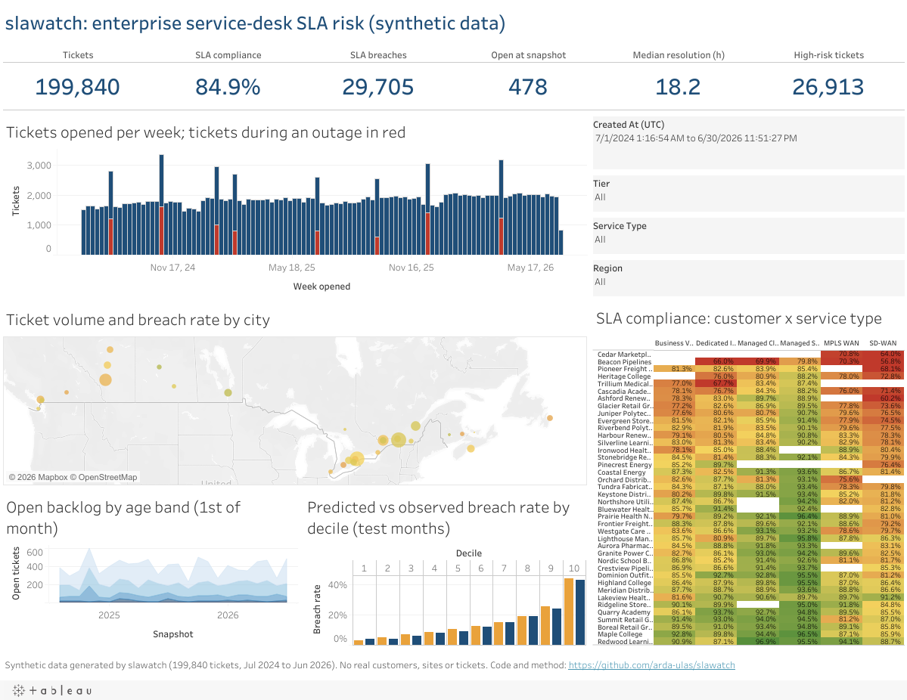

# Tableau Public dashboard (synthetic data)

> **Everything in `tableau/` is synthetic.** It is generated by `make tableau` from the
> PostgreSQL views over the seeded synthetic ticket book (`docs/data.md`). No real customer,
> site, network or ticket exists anywhere in these files. Every sheet title, the dashboard title
> and the published workbook title say so, and so should any copy of it.

**Published:** [slawatch: enterprise service-desk SLA risk (synthetic data)](https://public.tableau.com/app/profile/arda.ulas.ozdemir/viz/slawatch/slawatchenterpriseservice-deskSLArisksyntheticdata) on
Tableau Public.



The whole workbook is generated: `make tableau` writes the CSV extracts, one Hyper extract per
data source, the workbook XML (`slawatch.twb`) and the packaged workbook (`slawatch.twbx`, the
`.twb` plus the `.hyper` files, 6 MB, committed). Open `slawatch.twbx` in Tableau Public and
everything below is already built; see [Generated workbook](#generated-workbook-what-is-verified)
for what was verified in Tableau Public 2026.2 and where the generated workbook departs from
the click-by-click spec in sections 1-5, which is kept as the reference for rebuilding or
extending it by hand.

## Files

`make tableau` (`uv run slawatch-tableau`) writes:

| File | Rows | Size | Committed | Grain |
|---|---|---|---|---|
| `data/fact_ticket_synthetic.csv` | 199,840 | 57 MB | **no** (regenerate) | one row per ticket, with the model's probability, risk band and split, plus the customer and site attributes (name, industry, city, province, city-centroid latitude/longitude) so the workbook needs no relationships |
| `data/monthly_sla_compliance_synthetic.csv` | 5,248 | 525 KB | yes | creation month x customer x service type (`v_sla_compliance_monthly`) |
| `data/backlog_ageing_monthly_synthetic.csv` | 720 | 30 KB | yes | first-of-month snapshot x service type x age band, dense grid |
| `data/risk_calibration_deciles_synthetic.csv` | 10 | 1 KB | yes | predicted-probability decile x observed breach rate, test months |
| `data/weekly_kpi_synthetic.csv` | 104 | 7 KB | yes | one row per full Monday-Sunday week (`v_weekly_kpi`) |
| `data/dim_customer_synthetic.csv` | 40 | 2 KB | yes | customer, industry, tier, HQ province |
| `data/dim_site_synthetic.csv` | 444 | 38 KB | yes | site, city, province, region, **latitude / longitude** (hard-coded city centroids) |
| `data/dim_service_synthetic.csv` | 885 | 53 KB | yes | service instance, type, bandwidth, assignment group |
| `data/dim_outage_synthetic.csv` | 8 | 1 KB | yes | the injected regional outages with start/end and impact figures |
| `data/extract_metadata.json` | - | 1 KB | yes | generation timestamp, row counts, load snapshot, model version, `"synthetic": true` |
| `data/hyper/*.hyper` | as above | 12 MB | **no** (regenerate) | one Hyper extract per workbook source (`fact_ticket`, `monthly_sla_compliance`, `backlog_ageing`, `risk_calibration_deciles`, `weekly_kpi`), table `"Extract"."Extract"`, DATE / TIMESTAMP / DOUBLE / BIG INT / TEXT columns |
| `slawatch.twb` | - | 128 KB | yes | workbook XML: five Hyper data sources, calculated fields, eight sheets, the dashboard |
| `slawatch.twbx` | - | 6.1 MB | yes | the `.twb` packaged with the five `.hyper` files under `Data/slawatch/`; this is the file to open in Tableau Public |

Row counts and sizes are from the default run (`seed 20240701`, 200,000 tickets, snapshot
2026-07-01). The ticket-level CSV and the Hyper files are above the size this repo commits
(the `.twbx` carries the same rows in 6 MB), so regenerate them:

```bash
make db-up && make load && make train   # if the database is empty
make tableau                            # -> tableau/data/*.csv, data/hyper/*.hyper,
                                        #    tableau/slawatch.twb, tableau/slawatch.twbx (~25 s)
uv run slawatch-tableau --xlsx          # also data/slawatch_synthetic.xlsx (all extracts as sheets)
uv run slawatch-tableau --no-twb        # CSVs only (no tableauhyperapi needed)
```

Tableau Public refuses workbooks whose data sources are not extracts (error 3C242D89, "Workbooks
saved to Tableau Public must use extracts"), which is why the sources are `.hyper` files written
with `tableauhyperapi` (in the `reporting` extra, never in the Lambda image) rather than live
`textscan` connections to the CSVs.

Column conventions: Title Case labels with spaces, human-readable values (`SD-WAN`, `Field -
Ontario`, `Platinum`), ISO dates (`YYYY-MM-DD`) and UTC timestamps (`YYYY-MM-DD HH:MM:SS`), IDs
kept verbatim for joins. Numeric flags (`Is Breached`, `Has Outcome`, `Is Resolved`) are 0/1 with
no nulls so they can be summed. The only empty cells are `Resolved At (UTC)` / `Resolution Hours`
for open tickets, `Outage ID` for tickets outside an outage, `Bandwidth Mbps` for non-bandwidth
services and `SLA Compliance Pct` for month cells with no outcome-bearing ticket, all of which
Tableau treats as null without complaint.

## 1. Data sources and relationships

Tableau Public web authoring can relate several tables only when they come from **one uploaded
file**, hence the `--xlsx` option. Tableau Public Desktop can relate several CSVs from the same
folder.

### Source A: `Tickets (synthetic)` - the fact with its dimensions

1. **Connect > To a File > Text file** (Desktop) or **Create > Workbook > Upload from computer**
   (web, choose `slawatch_synthetic.xlsx`). Pick `fact_ticket_synthetic.csv` / the
   `fact_ticket` sheet.
2. Drag the other tables onto the canvas one at a time; Tableau creates **relationships**
   (the noodle, not a join). Set each relationship's fields:

   | Drag | Relate on |
   |---|---|
   | `dim_customer_synthetic` | `Customer ID` = `Customer ID` |
   | `dim_site_synthetic` | `Site ID` = `Site ID` |
   | `dim_service_synthetic` | `Service ID` = `Service ID` |
   | `dim_outage_synthetic` | `Outage ID` = `Outage ID` |

   Leave *Performance Options* at the defaults (cardinality many-to-one, referential integrity
   "some records match", because `Outage ID` is blank for most tickets).
3. In the data grid, check the types Tableau inferred: `Created At (UTC)` and
   `Resolved At (UTC)` must be **Date & Time**, `Breach Probability`, `Resolution Hours`,
   `SLA Target Hours`, `Latitude`, `Longitude` **Number (decimal)**, `Is Breached`, `Has Outcome`,
   `Is Resolved` **Number (whole)**. Right-click `Latitude` > *Geographic Role > Latitude*, and
   `Longitude` > *Longitude*. Set `Province` (dim_site) to *Geographic Role > State/Province*.
4. Rename the data source `Tickets (synthetic)`. Keep it as a **live** connection to the file
   (Tableau Public converts it to an extract on publish).

### Sources B-E: the aggregates (one flat table each)

Add each as **its own data source** (Data > New Data Source), no relationships:

| Data source name | File / sheet |
|---|---|
| `Monthly SLA compliance (synthetic)` | `monthly_sla_compliance_synthetic` |
| `Backlog ageing (synthetic)` | `backlog_ageing_monthly_synthetic` |
| `Risk calibration (synthetic)` | `risk_calibration_deciles_synthetic` |
| `Weekly KPI (synthetic)` | `weekly_kpi_synthetic` |

Check `Month`, `Snapshot Date`, `Week Ending` are **Date**. In `Backlog ageing`, right-click
`Age Band` > *Default Properties > Sort* > *Manual*: `0-24h`, `1-3d`, `3-7d`, `7-30d`, `30d+`
(or sort by field `Age Band Order`, ascending, Minimum).

## 2. Calculated fields (exact formulas)

Create these with *Analysis > Create Calculated Field*. Names are used verbatim below.

On **Tickets (synthetic)**:

| Name | Formula | Notes |
|---|---|---|
| `Tickets` | `COUNTD([Ticket ID])` | |
| `Breaches` | `SUM([Is Breached])` | |
| `SLA Compliance %` | `1 - SUM([Is Breached]) / SUM([Has Outcome])` | format as percentage, 1 decimal |
| `Breach Rate %` | `SUM([Is Breached]) / SUM([Has Outcome])` | |
| `Resolved Tickets` | `SUM([Is Resolved])` | |
| `Open Tickets` | `SUM(IIF([Status] = 'Cancelled', 0, 1 - [Is Resolved]))` | open at the load snapshot (2026-07-01) |
| `Median Resolution Hours` | `MEDIAN([Resolution Hours])` | |
| `P90 Resolution Hours` | `PERCENTILE([Resolution Hours], 0.9)` | |
| `High Risk Tickets` | `SUM(IIF([Risk Band] = 'High', 1, 0))` | |
| `Outage Tickets` | `SUM(IIF([During Outage] = 'Yes', 1, 0))` | the outage markers on the volume chart |
| `Probability Decile` | `INT([Breach Probability] * 10) + 1` | row-level; convert to **Dimension**, discrete |
| `Created Week` | `DATETRUNC('week', [Created At (UTC)])` | Tableau weeks start on Sunday by default; *Data source > Date Properties > Week start = Monday* to match the report |
| `Created Month` | `DATETRUNC('month', [Created At (UTC)])` | |
| `Site Label` | `[City] + ', ' + [Province]` | (fields from dim_site) map tooltip |

On **Monthly SLA compliance (synthetic)**:

| Name | Formula |
|---|---|
| `Compliance %` | `1 - SUM([Breached Tickets]) / SUM([Tickets With Outcome])` |
| `Breach Rate %` | `SUM([Breached Tickets]) / SUM([Tickets With Outcome])` |

On **Backlog ageing (synthetic)**: `Past Due Share` = `SUM([Past Due Tickets]) / SUM([Open Tickets])`.

On **Risk calibration (synthetic)**: `Calibration Gap` = `SUM([Observed Breach Rate]) - SUM([Mean Predicted])`.

On **Weekly KPI (synthetic)**: `Compliance %` = `1 - SUM([Breached Tickets]) / SUM([Tickets Resolved])`.

Parameters (optional, *Create > Parameter*): `Compliance target` - float, default `0.85`, used
for the heatmap centre and a reference line.

## 3. Sheets

Build each on a new worksheet (*Worksheet > New Worksheet*), rename it as given.

### Sheet 1: `KPI BANs`  (source: Tickets)

1. Drag **Measure Names** to *Columns*, **Measure Values** to *Text* (Marks card).
2. In the Measure Values card keep exactly: `Tickets`, `SLA Compliance %`, `Breaches`,
   `Open Tickets`, `Median Resolution Hours`, `High Risk Tickets` (remove the rest, drag to
   reorder).
3. Marks: *Text*, then *Text > ...* : font 24 bold, centred. Format `SLA Compliance %` as
   Percentage 1 dp, hours as Number 1 dp, counts as Number 0 dp with thousands separator.
4. Hide the sheet title, hide the *Measure Names* header (right-click header > *Hide Field
   Labels for Columns*). Fit: *Entire View*.

### Sheet 2: `Ticket volume over time`  (source: Tickets)

1. *Columns*: `Created At (UTC)` > right-click > **Week** (the continuous, green one, second
   "Week" entry in the menu).
2. *Rows*: `Tickets`. Marks: *Line*. Colour: navy `#1F4E78`.
3. Drag `Outage Tickets` onto the same axis area until the dual-axis indicator appears
   (or drop it on *Rows* and right-click > *Dual Axis*). Right-click the right axis >
   *Synchronize Axis*. On the `Outage Tickets` Marks card choose *Bar*, colour red `#C0392B`,
   size small. Uncheck *Show Header* on the right axis.
4. Annotations: for each outage, *right-click the spike > Annotate > Point*, text
   `<Outage ID> <Cause>` (from `dim_outage_synthetic.csv`: OUT-001 core router failure
   2024-08-11 ... OUT-008 firmware rollout regression 2026-04-03).
5. Tooltip: `Week of <Created At (UTC)>: <Tickets> tickets, <Outage Tickets> during an outage,
   compliance <SLA Compliance %>` (add `SLA Compliance %` to *Tooltip* on the All card).
6. Title: `Tickets opened per week, with outage tickets in red`.

### Sheet 3: `SLA compliance heatmap`  (source: Monthly SLA compliance)

1. *Rows*: `Customer`. *Columns*: `Service Type`.
2. Marks: *Square*. Drag `Compliance %` to *Colour* and again to *Label*.
3. Colour: *Edit Colours* > palette *Red-Green Diverging* (or the custom `slawatch diverging`
   below), **Reversed off**, *Advanced*: Start `0.70`, Center `0.85` (the compliance target),
   End `1.00`; 5 stepped colours.
4. Sort `Customer` by *Field* `Compliance %`, ascending (worst at the top): right-click
   `Customer` on Rows > *Sort* > Sort by Field, Ascending, `Compliance %`, Aggregation *Custom*
   is not needed (the calc is already aggregate).
5. Add `Month` to *Filters* > *Range of Dates*; show the filter (it becomes the dashboard's date
   range for this sheet). Add `Tier` to *Filters* (all, show filter).
6. Label: font 8, format 0 dp percentage. Title: `SLA compliance by customer and service type`.

### Sheet 4: `Backlog ageing`  (source: Backlog ageing)

1. *Columns*: `Snapshot Date` > continuous **Month**. *Rows*: `SUM(Open Tickets)`.
2. Marks: *Area*. *Colour*: `Age Band` (manual sort order above; palette `slawatch age bands`).
3. Analysis menu > *Stack Marks > On*. Tooltip add `SUM(Past Due Tickets)` and `Past Due Share`.
4. *Filters*: `Service Type` (show filter, multiple values dropdown).
5. Title: `Open backlog on the 1st of each month, by age band`.

### Sheet 5: `Risk calibration`  (source: Risk calibration)

1. *Columns*: `Decile` (discrete, blue). *Rows*: `SUM(Observed Breach Rate)`.
2. Marks: *Bar*, colour navy. Drag `SUM(Mean Predicted)` to *Rows*, right-click > *Dual Axis*,
   *Synchronize Axis*; set its Marks to *Line* with circles, colour amber `#E9A23B`.
3. Format both axes as percentage 0 dp; hide the right axis header. Label bars with
   `Observed Breach Rate` (0 dp %). Tooltip: `Decile <Decile>: predicted <Mean Predicted>,
   observed <Observed Breach Rate> over <Tickets> test tickets`.
4. Title: `Predicted vs observed breach rate by probability decile (test months, Apr-Jun 2026)`.
   Reading: bars close to the line = calibrated; decile 10 (observed 43.1 %) versus decile 1
   (4.1 %) is the ranking power.

### Sheet 6: `Site map`  (source: Tickets, fields from dim_site)

1. Double-click `Longitude` then `Latitude` (from `dim_site_synthetic`) - Tableau draws the
   map. Drag `City` and `Province` to *Detail*.
2. Marks: *Circle*. *Size*: `Tickets`. *Colour*: `Breach Rate %`, palette *Orange-Blue Diverging*
   reversed (red = worse) or the custom diverging, centre `0.15`.
3. Tooltip: `<Site Label>: <Tickets> tickets, breach rate <Breach Rate %>, <High Risk Tickets>
   high-risk`.
4. Map layers: *Map > Map Layers*, style *Light*, washout 30 %. Title: `Ticket volume and breach
   rate by city`.

### Sheet 7 (optional): `Customer drill-down`  (source: Tickets)

*Rows*: `Customer` (dim_customer), `Tier`; Measure Values as text: `Tickets`, `SLA Compliance %`,
`Breaches`, `Open Tickets`, `High Risk Tickets`, `Median Resolution Hours`. Sort by `Breaches`
descending. This is the target of the heatmap's filter action below.

## 4. Dashboard

*Dashboard > New Dashboard*. Size: **Fixed size, 1200 x 900** (Size card > Custom).

Layout (drag *Horizontal* / *Vertical* containers from the Objects pane, then the sheets):

```
+------------------------------------------------------------------------------+
| Title (Text object, height 60)                                               |
| "SLA Watch - Synthetic data - Enterprise service-desk SLA-breach risk"       |
+------------------------------------------------------------------------------+
| KPI BANs (height 110, full width)                                            |
+---------------------------------------------+--------------------------------+
| Ticket volume over time (w 780, h 250)      | Filters (Vertical container,   |
+---------------------------------------------+  w 400, h 730):                |
| SLA compliance heatmap (w 780, h 250)       |   Created At (UTC) range       |
+----------------------+----------------------+   Tier                         |
| Backlog ageing       | Risk calibration     |   Service Type                 |
| (w 390, h 230)       | (w 390, h 230)       |   Region                       |
+----------------------+----------------------+   Site map (h 380, below the   |
                                               |   filters)                    |
+------------------------------------------------------------------------------+
| Footer text (h 30): "Synthetic data generated by slawatch (seed 20240701,    |
| 200,000 tickets, 2024-07 to 2026-06). Model 0.1.0. Not a real service desk." |
+------------------------------------------------------------------------------+
```

Title text object: 20 pt bold navy; the words **Synthetic data** must stay in the title.

Filters (add from the *KPI BANs* sheet's menu > *Filters*; each filter card in the right
container):

| Filter | Field (Tickets source) | Style | Apply to |
|---|---|---|---|
| Date range | `Created At (UTC)` | Range of dates slider | *All Using Related Data Sources* |
| Tier | `Tier` | Multiple values (dropdown) | *All Using Related Data Sources* |
| Service type | `Service Type` | Multiple values (dropdown) | *All Using Related Data Sources* |
| Region | `Region` (dim_site) | Single value (dropdown), *All* allowed | *All Using This Data Source* |

`Tier`, `Service Type`, `Region` and the month/date fields exist under the same names in the
aggregate sources, so *All Using Related Data Sources* also filters the heatmap and the backlog
area; Tableau lists the related fields under *Data > Edit Blend Relationships* if a name does
not line up. The risk-calibration sheet is intentionally unfiltered (fixed test-set numbers).

Actions (*Dashboard > Actions > Add Action*):

| Action | Type | Source | Target | Run on | Clearing |
|---|---|---|---|---|---|
| `Customer -> details` | Filter | SLA compliance heatmap | Customer drill-down, Site map (field `Customer ID`) | Select | Show all values |
| `Service highlight` | Highlight | Ticket volume, Backlog ageing, Site map | all sheets, field `Service Type` | Hover | - |
| `Outage -> week` | Filter | Ticket volume over time | Site map (`Created Week`) | Select | Show all values |

Then *File > Save to Tableau Public As...*, name `SLA Watch (synthetic data)`, and in the publish
dialog keep *Show sheets as tabs* off and *Show viz on profile* as you prefer.

## 5. Colour palette

Copy into `~/Documents/My Tableau Repository/Preferences.tps` (Desktop; restart Tableau) and pick
the palettes by name, or set the hex codes by hand in *Edit Colours*:

```xml
<?xml version='1.0'?>
<workbook>
  <preferences>
    <color-palette name="slawatch categorical" type="regular">
      <color>#1F4E78</color> <!-- navy: tickets, primary -->
      <color>#2A9D8F</color> <!-- teal: resolved -->
      <color>#E9A23B</color> <!-- amber: predicted / medium risk -->
      <color>#C0392B</color> <!-- red: breaches, outages, high risk -->
      <color>#2E7D32</color> <!-- green: compliant / low risk -->
      <color>#8A8F98</color> <!-- grey: baseline, other -->
    </color-palette>
    <color-palette name="slawatch age bands" type="regular">
      <color>#CFE1F2</color> <!-- 0-24h -->
      <color>#93C4E0</color> <!-- 1-3d -->
      <color>#4A90C4</color> <!-- 3-7d -->
      <color>#1F4E78</color> <!-- 7-30d -->
      <color>#C0392B</color> <!-- 30d+ -->
    </color-palette>
    <color-palette name="slawatch diverging" type="ordered-diverging">
      <color>#C0392B</color>
      <color>#F4D35E</color>
      <color>#2E7D32</color>
    </color-palette>
    <color-palette name="slawatch sequential" type="ordered-sequential">
      <color>#DCE6F1</color>
      <color>#1F4E78</color>
    </color-palette>
  </preferences>
</workbook>
```

Risk bands: Low `#2E7D32`, Medium `#E9A23B`, High `#C0392B`. Background white, gridlines
`#E5E7EB`, text `#1F2937`. Fonts: Tableau Book, titles 14 bold, BANs 24 bold.

## Generated workbook: what is verified

`make tableau` writes `slawatch.twb` and `slawatch.twbx` from the same frames as the CSVs. The
XML follows the shape Tableau itself writes, copied from the Superstore and World Indicators
sample workbooks that ship with Tableau Public (a `federated` data source with a `hyper`
named connection, `[Extract].[Extract]` relation and `metadata-records`; `column-instance`
shelf names such as `[usr:Tickets:qk]`; `manual-sort` / `computed-sort`, which need
`SortTagCleanup` in the `document-format-change-manifest`; dashboard `zone` trees in
1/100000 coordinates). Tableau validates the file against its schema on open and reports every
offending element, so the generator was iterated against Tableau Public 2026.2 until the file
opened cleanly.

Verified in Tableau Public 2026.2 (macOS, Apple silicon) on 2026-09-16:

| Part | Verified |
|---|---|
| `slawatch.twbx` opens with no error dialog; all five sources load from the packaged `.hyper` files; dates, timestamps and numbers have the right types | yes |
| `KPI BANs`: 199,840 tickets, 84.9 % compliance, 29,705 breaches, 478 open at snapshot, 18.2 h median resolution, 26,913 high-risk | yes |
| `Ticket volume over time`: weekly bars, outage-week tickets in red (113 weeks) | yes |
| `SLA compliance heatmap`: 40 customers x 6 service types, red-yellow-green centred on 85 %, worst customer first, month-range and tier filters | yes |
| `Backlog ageing`: stacked area by age band with the README palette, service-type filter | yes |
| `Risk calibration`: predicted (amber) vs observed (navy) breach rate for deciles 1-10, 3.1 % / 4.1 % up to 43.8 % / 43.1 % | yes |
| `Site map`: 29 cities on a Mapbox base map, size = tickets, colour = breach rate | yes |
| `Customer drill-down`: 40 customers x tier, six measures, sorted by breaches | yes |
| `Weekly compliance`: weekly compliance line (not on the dashboard) | yes |
| Dashboard, fixed 1200 x 900: title, KPI row, volume, map, backlog, calibration, four filters (date range, tier, service type, region) and the heatmap; footer with the synthetic-data note and the repository link | yes |
| Published to Tableau Public from Tableau Public 2026.2 (workbook `slawatch`); the screenshot above is the rendering served by public.tableau.com | yes, see the link at the top |

Where the generated workbook departs from the spec in sections 1-5, on purpose:

* **One ticket source, no relationships.** The fact extract carries the customer and site
  attributes, so the map and the drill-down read `Tickets (synthetic)` directly. The dimension
  CSVs are still written for anyone who wants them.
* **Outage markers** are the `During Outage = Yes` tickets stacked in red inside each weekly
  bar, not a dual-axis bar; **risk calibration** shows predicted and observed as side-by-side
  bars per decile, not bar + line. Both avoid the dual-axis XML and read the same way.
* **Filters** are the four quick filters on the ticket source, stored with the same
  `filter-group` in every ticket sheet (Tableau's "all using this data source"). The aggregate
  sources keep their own filters on the sheets (month range and tier on the heatmap, service
  type on the backlog); dashboard actions are not generated.
* **Formatting** is the minimum that reads well: navy/red/amber/green from section 5, cell
  fonts on the BANs and the heatmap, hidden field labels. Anything finer is a two-minute edit
  in Tableau Public after opening the `.twbx`.

If a future Tableau version rejects an element, the error dialog names the element and line;
`tests/test_tableau.py` checks the structure (sources, extracts, sheets, dashboard, packaging)
but cannot replace opening the file in Tableau.
